# Customer journey map skill

A Claude skill that helps a PM map a customer journey as a time-by-feeling curve, then call out pain points (dips), delights (peaks) and features that could lift the dips.

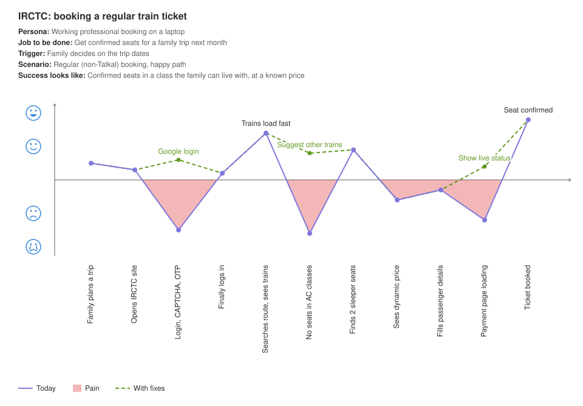

Every map prints its scope (persona, job to be done, trigger, scenario, success criteria) and draws:

- a smiley-face y-axis, from crying to ecstatic
- red shading wherever the journey drops below neutral
- callouts explaining why the user was delighted at each peak
- a dashed green line showing the journey with fixes in place

## The core rule: one unit of time, one action

A user can only do one thing at a time. Each unit of time is one loop, so the map is mutually exclusive and collectively exhaustive by construction.

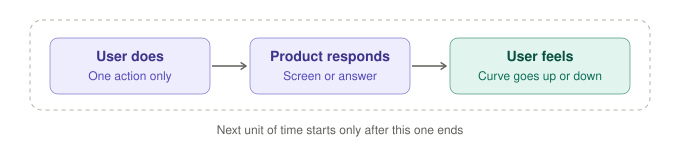

The feeling is cumulative: each step adds to or subtracts from where the user was a moment ago, which is why a dip right after a high hurts more than the same dip at the start.

## Non-AI vs AI products

You draw both kinds of map the same way. What changes is what a step is and where dips come from:

- **Non-AI (IRCTC):** steps are screens, so a dip means a broken screen and the fix is a feature.
- **AI (Hindi clerk bot):** steps are conversation turns, so a dip means a bad answer and the fix is a line in the system prompt, checked by an eval.

## How to use it

1. Install the skill. In GitHub Copilot CLI, type: "install the skill from github.com/Mitalee/Customer-Journey-Mapping into my personal skills". (In Claude, add `customer-journey-map.skill` as a skill instead.)
2. Ask about any feature or product, for example: "Map the journey of a first-time user booking a hotel on our app" or "Where are users dropping off in our onboarding?"
3. Answer a few scoping questions (who the user is, what they're trying to do, what success looks like). You get the map with pain points, delights and suggested fixes.
4. Give a thumbs up or down at the end. Your question, the map and your rating are sent to the skill owner so the skill keeps improving. Say "don't log" at the start to opt out.

## What's in this repo

| Path | What it is |
|---|---|
| `customer-journey-map.skill` | The packaged skill, ready to install in Claude |
| `customer-journey-map/SKILL.md` | The workflow Claude follows |
| `customer-journey-map/references/examples.md` | The 14 worked examples, with how to read each |
| `customer-journey-map/references/map_format.md` | The JSON format the render script reads |
| `customer-journey-map/scripts/render_map.py` | Turns a journey JSON into an SVG map |
| `rendered-examples/` | Every example as JSON, SVG and PNG |
| `customer-journey-map/config.json` | Skill version and where feedback is sent |
| `collector/` | The feedback server (for the skill owner) |
| `docs/` | Diagrams used in this README |

## For the skill owner: feedback collector

Every run sends two events to the URL in `customer-journey-map/config.json`: one when the map is drawn, one when the PM rates it. If the server is unreachable, events wait on the PM's laptop and are sent next time.

To run the collector (needs Docker):

```bash
cd collector
docker compose up -d
```

Then open `http://localhost:8000/review` to see every run, thumbs-down first, with a link to each map. Data is stored in `collector/data/cjm.db`.

## For contributors

The map is drawn by `customer-journey-map/scripts/render_map.py` (Python 3, no extra packages) from a JSON file in the format described in `references/map_format.md`. Bump `skill_version` in `config.json` whenever SKILL.md changes, so feedback can be compared across versions.

## Example gallery

### Non-AI consumer products

**IRCTC: booking a regular train ticket**  
Job to be done: Get confirmed seats for a family trip next month


[JSON input](rendered-examples/01-irctc-regular.json) · [PNG](rendered-examples/01-irctc-regular.png)

**IRCTC: Tatkal booking at 10 am**  
Job to be done: Get any confirmed seat for an urgent trip

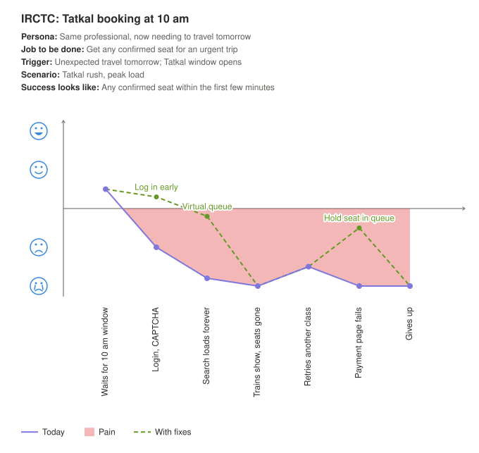

[JSON input](rendered-examples/02-irctc-tatkal.json) · [PNG](rendered-examples/02-irctc-tatkal.png)

**BookMyShow: a spontaneous evening out**  
Job to be done: Have fun with a friend this evening (not 'book a movie')

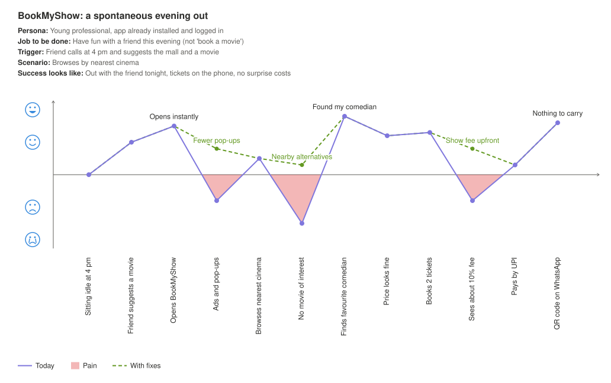

[JSON input](rendered-examples/03-bookmyshow-evening-out.json) · [PNG](rendered-examples/03-bookmyshow-evening-out.png)

**MakeMyTrip: booking a hotel in Goa**  
Job to be done: Lock in a good-value, well-reviewed hotel for a family trip

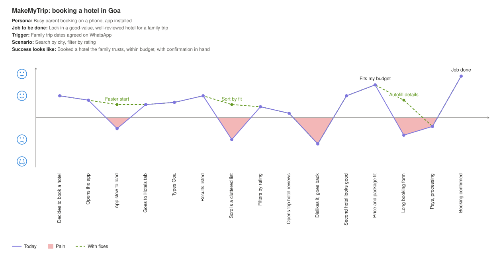

[JSON input](rendered-examples/04-makemytrip-hotel.json) · [PNG](rendered-examples/04-makemytrip-hotel.png)

**Uber: getting home after a concert**  
Job to be done: Get home quickly and safely after the event

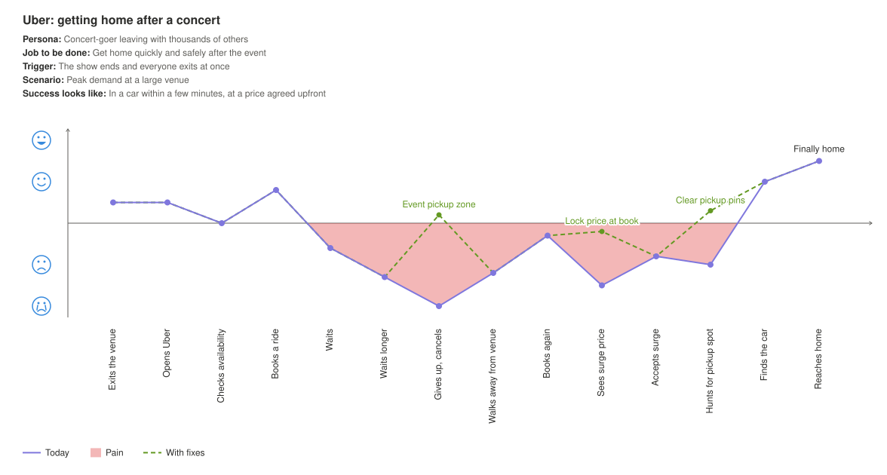

[JSON input](rendered-examples/05-uber-large-event.json) · [PNG](rendered-examples/05-uber-large-event.png)

### B2B and platform products

**Khaata: from sign-up to first recharge**  
Job to be done: Get Shopify orders into Tally without manual entry

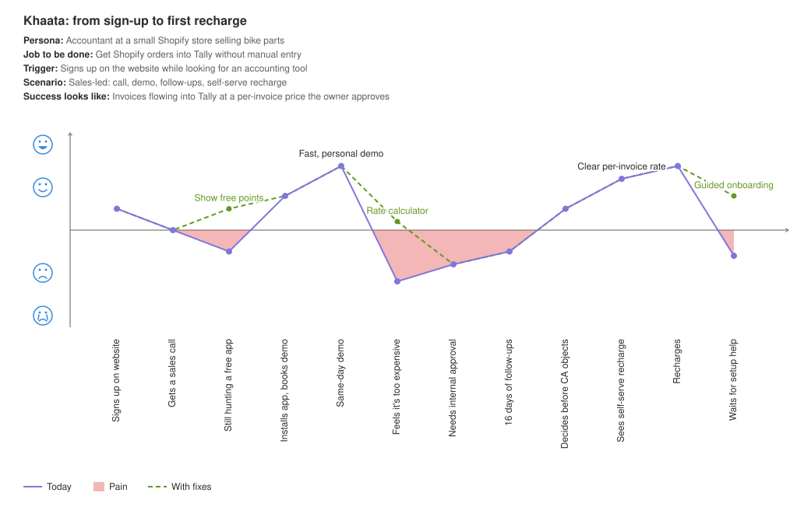

[JSON input](rendered-examples/06-khaata-merchant.json) · [PNG](rendered-examples/06-khaata-merchant.png)

**Shopify: a merchant adding a third-party app**  
Job to be done: Plug a gap in the selling lifecycle without hurting the store

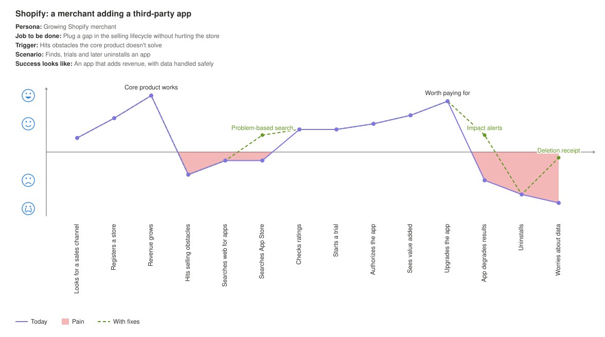

[JSON input](rendered-examples/07-shopify-merchant.json) · [PNG](rendered-examples/07-shopify-merchant.png)

**Shopify: an app developer's journey**  
Job to be done: Build a profitable app on the Shopify ecosystem

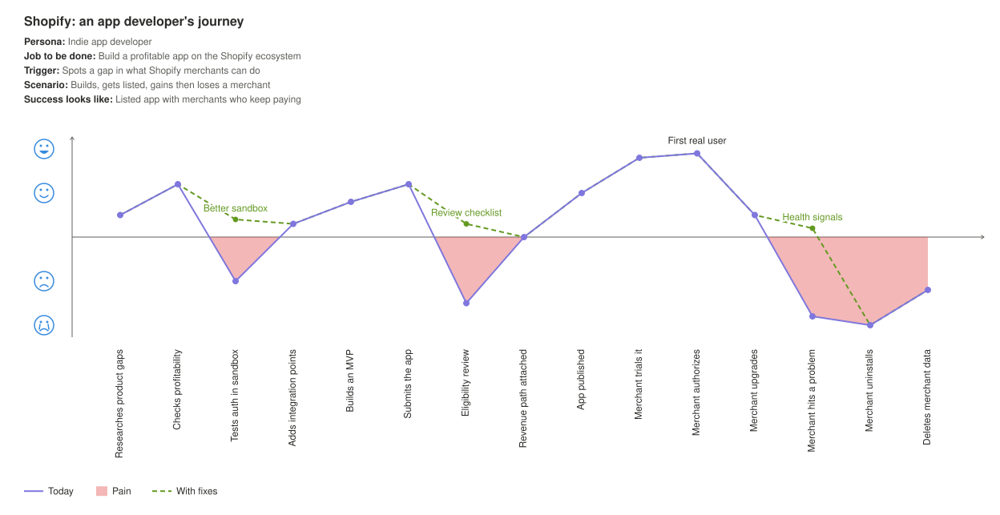

[JSON input](rendered-examples/08-shopify-app-developer.json) · [PNG](rendered-examples/08-shopify-app-developer.png)

### Life journeys (map these before building anything)

**Learning crochet today (no new app)**  
Job to be done: Make a first finished crochet piece

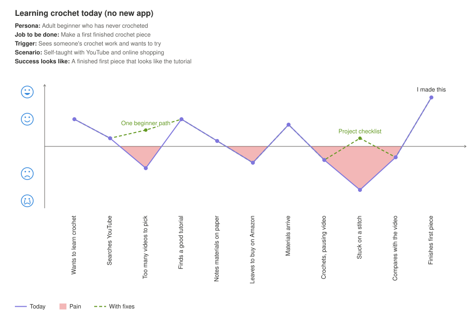

[JSON input](rendered-examples/09-crochet-learner.json) · [PNG](rendered-examples/09-crochet-learner.png)

**Making a first investment**  
Job to be done: Start growing savings without losing sleep

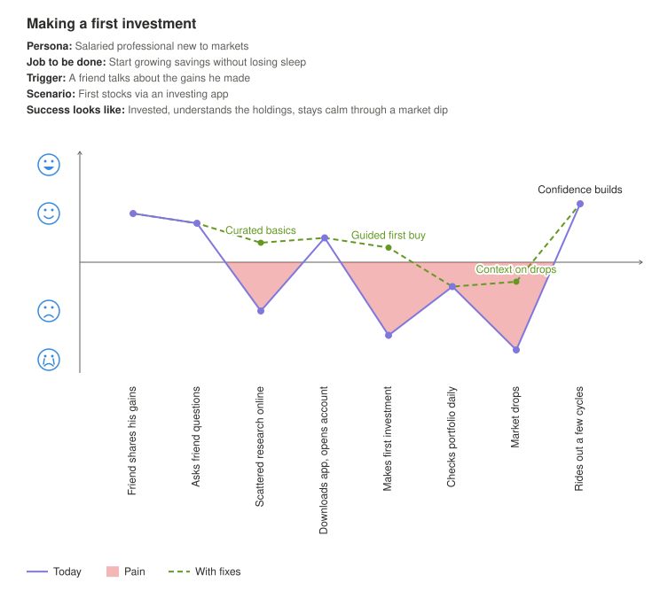

[JSON input](rendered-examples/10-first-investment.json) · [PNG](rendered-examples/10-first-investment.png)

**Rescuing an injured puppy**  
Job to be done: Get the animal safe care fast, and know it recovered

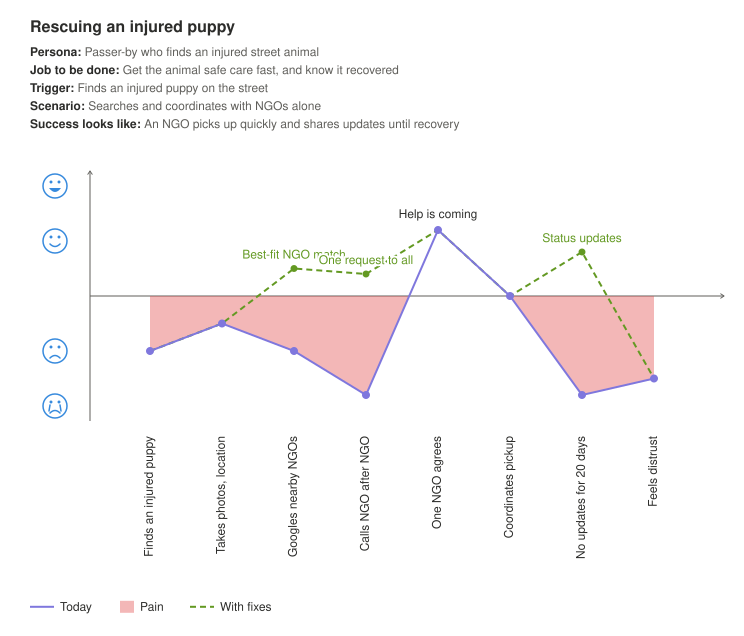

[JSON input](rendered-examples/11-puppy-rescue.json) · [PNG](rendered-examples/11-puppy-rescue.png)

### AI products

**Hindi clerk bot: asking about a report**  
Job to be done: Find out where a report stands, in my language

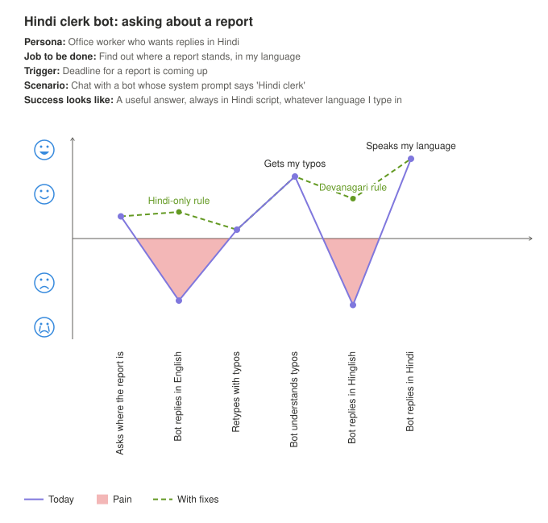

[JSON input](rendered-examples/12-hindi-clerk-bot.json) · [PNG](rendered-examples/12-hindi-clerk-bot.png)

**Santra.com assistant: is this top right for work?**  
Job to be done: Buy professional clothing for work presentations with confidence

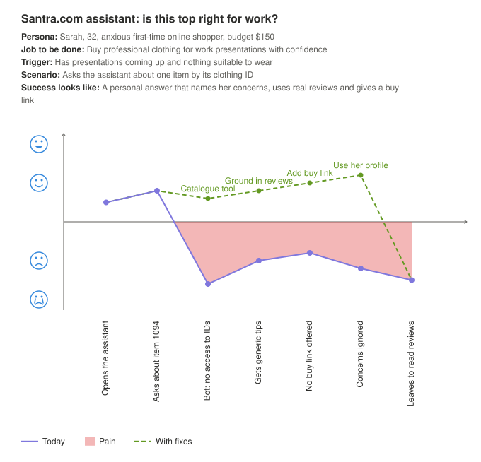

[JSON input](rendered-examples/13-santra-shopping-assistant.json) · [PNG](rendered-examples/13-santra-shopping-assistant.png)

**Telecom support: reaching a human**  
Job to be done: Get the parent's phone problem fixed

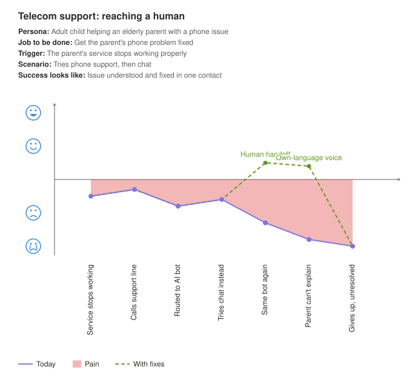

[JSON input](rendered-examples/14-telecom-support-bot.json) · [PNG](rendered-examples/14-telecom-support-bot.png)
